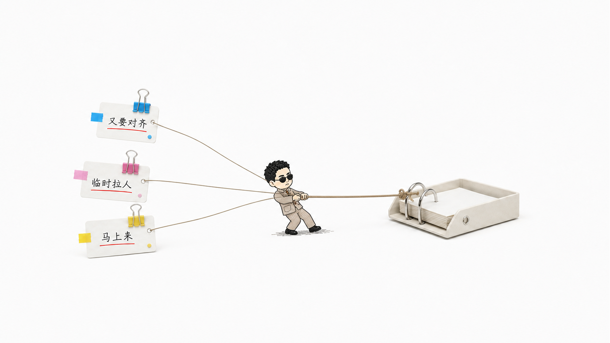
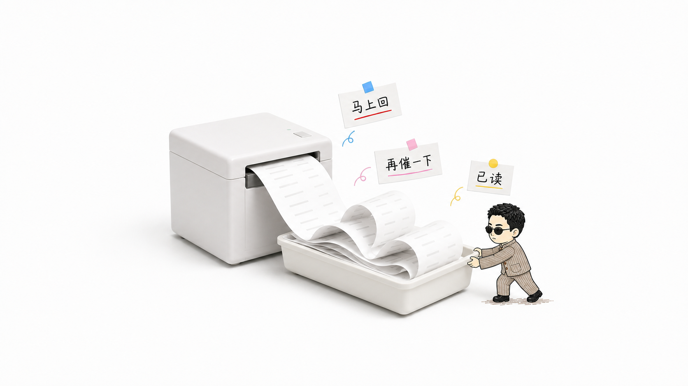
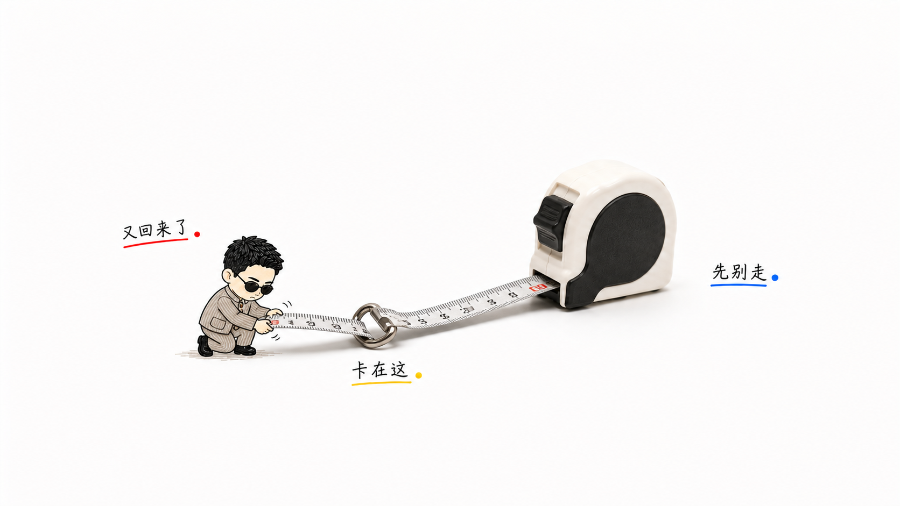
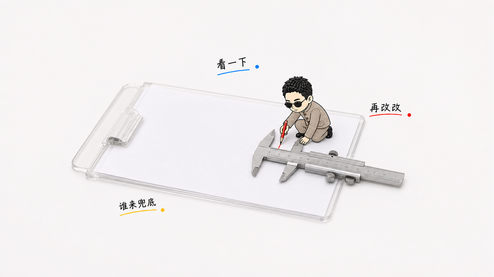
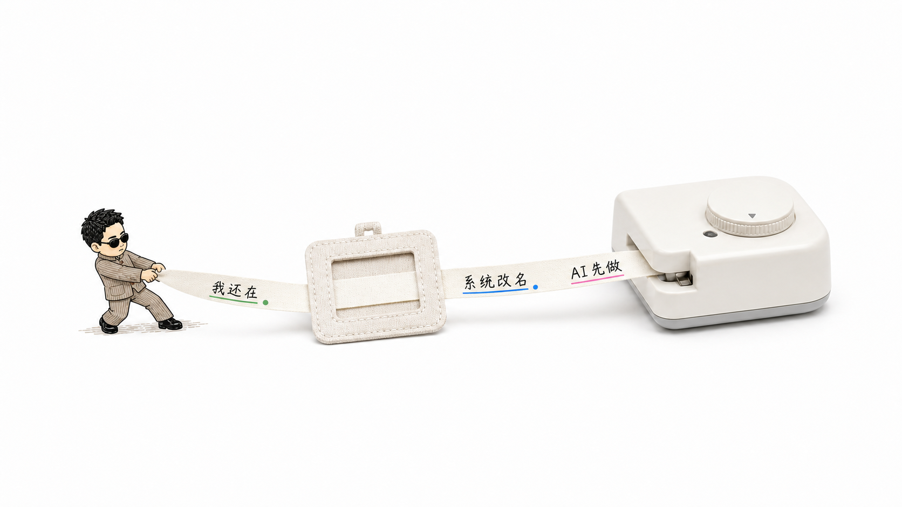
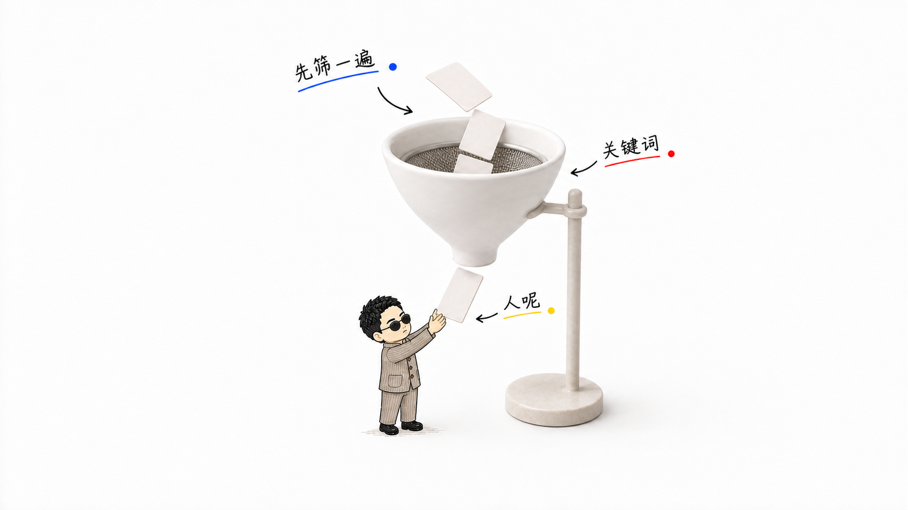
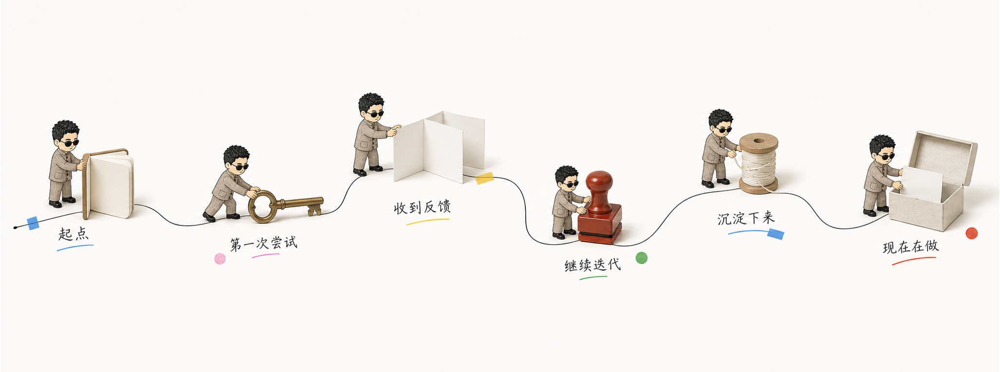

# Silas Hand-Drawn Real-Object Scenes

把中文文章观点、职场处境、项目复盘和成长路径，转成“扁平手绘 Silas + 摄影质感真实物件 + 物理动作 + 大留白”的正文配图与长卷故事图。

- Codex Skill：`silas-handdrawn-real-object-scenes`
- 标准模式：16:9 正文配图
- 长卷模式：项目复盘、个人路径、产品演化与成长叙事
- 角色语言：细黑墨线、暖灰褐彩铅轻铺色、窄椭圆黑墨镜
- 混合媒介：真实物件保持摄影质感，只有 Silas 与少量标注使用手绘语言
- 隐私边界：仓库不包含原始真人照片

## 效果展示

| 临时任务拉入 | 消息小票过载 |
| --- | --- |
| [](assets/examples/01-task-pull-in.png) | [](assets/examples/02-receipt-overload.png) |

| 返工回弹卡点 | 交付审查 |
| --- | --- |
| [](assets/examples/03-return-loop-snag.png) | [](assets/examples/04-review-clamp.png) |

| 系统重新贴标签 | 规则筛选 |
| --- | --- |
| [](assets/examples/05-system-relabel.png) | [](assets/examples/06-filter-gate.png) |

### 创作路线长卷

[](assets/examples/07-creation-route-long-scroll.png)

## 安装

```bash
python3 ~/.codex/skills/.system/skill-installer/scripts/install-skill-from-github.py \
  --repo SilasMaker/silas-handdrawn-real-object-scenes \
  --path . \
  --name silas-handdrawn-real-object-scenes
```

安装后重启 Codex，并在任务中直接说：

```text
使用 $silas-handdrawn-real-object-scenes，把这段中文内容做成一组扁平手绘 Silas 真实物件正文配图。
```

完整工作流、身份约束、母版选择与 QA 规则见 [`SKILL.md`](SKILL.md)。
